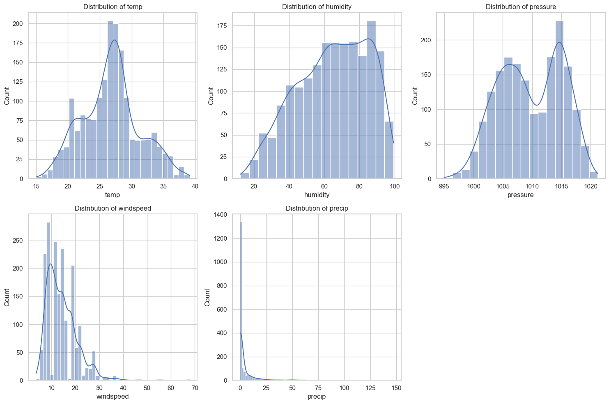
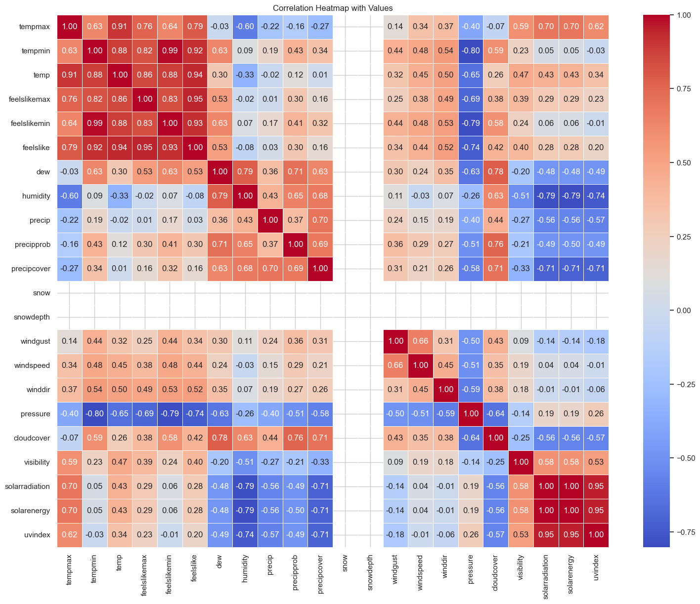
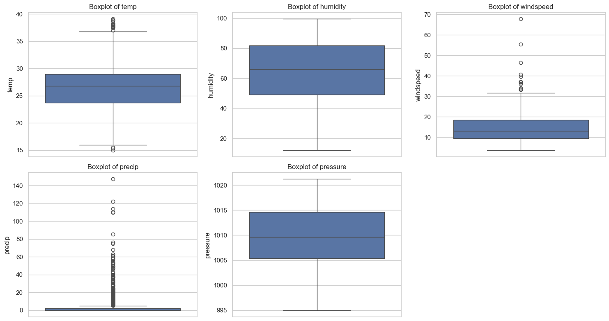
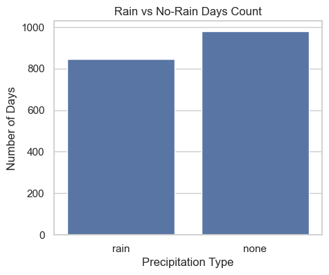
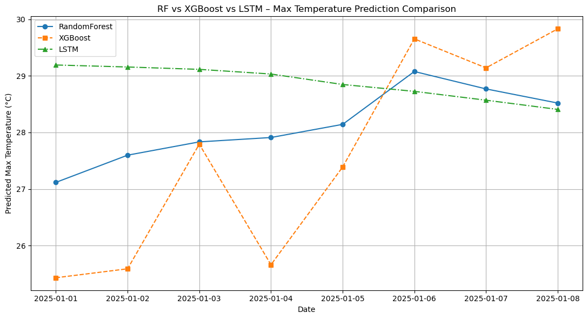

# NAGPUR_WEATHERDATA_2020_TO_2024
# Weather Prediction for Nagpur (2020–2026) using ML & LSTM

This project focuses on analyzing historical weather data for Nagpur and predicting future weather patterns using Machine Learning and Deep Learning techniques. The goal is to compare traditional regression models with time-series forecasting models and evaluate their performance.

---

## Project Objectives

- Analyze historical weather data (2020–2024)
- Perform exploratory data analysis and visualization
- Predict weather parameters using Machine Learning models
- Apply LSTM for short-term time-series forecasting
- Compare RandomForest, XGBoost, and LSTM models
- Predict weather for future dates (1 Jan 2026 – 7 Jan 2026)

---

## Dataset Description

- Location: Nagpur, India
- Time Period: 2020–2024
- Data Format: CSV
- Key Features:
  - Maximum Temperature
  - Minimum Temperature
  - Humidity
  - Wind Speed
  - Pressure
  - Rain Information

Missing values were removed and the data was cleaned before analysis and modeling.

---

## Exploratory Data Analysis (EDA)

### 1. Distribution of Weather Variables

This plot shows the distribution of major weather parameters such as temperature, humidity, wind speed, and pressure. It helps in understanding the range, skewness, and spread of the data before applying machine learning models.

---

### 2. Correlation Heatmap

The correlation heatmap visualizes the relationship between numerical weather variables. It helps identify which features are positively or negatively correlated and assists in feature selection.

---

### 3. Outlier Analysis

This visualization highlights columns where outliers commonly appear. Identifying outliers is important to improve model stability and reduce prediction errors.

---

### 4. Rain vs No-Rain Days Analysis

This bar chart shows the count of rainy and non-rainy days in the dataset. It provides insights into rainfall distribution and class imbalance.

---

## Machine Learning Models

### RandomForest Regressor
- Used as a baseline regression model
- Input: Date-based engineered features
- Strength: Good generalization and stable predictions

### XGBoost Regressor
- Boosting-based regression model
- Strong learner but sensitive to overfitting
- Overfitting observed due to limited input features

---

## Model Comparison Visualization

This graph compares the predicted maximum temperature from RandomForest, XGBoost, and LSTM models for the same dates.  
RandomForest shows a smooth and stable trend, XGBoost exhibits higher fluctuations, and LSTM provides a smooth short-term forecast.

---

## Deep Learning Model: LSTM

### LSTM Training Approach
- Sliding window of last 7 days
- Predicts the next day’s weather
- Captures temporal dependency in time-series data

### LSTM Future Prediction (2026)

.png)

This graph shows LSTM-based predictions for maximum and minimum temperature from 1 January 2026 to 7 January 2026.  
The smooth trends indicate stable short-term forecasting and realistic seasonal behavior.

---

## Model Performance Summary

| Model | Key Observation |
|------|----------------|
| RandomForest | Best generalization and highest test R² |
| XGBoost | Overfitting observed |
| LSTM | Stable short-term time-series forecasting |

---
## Conclusion

This project demonstrates that traditional Machine Learning models such as RandomForest perform well for date-based weather prediction, while LSTM is more suitable for short-term time-series forecasting. Combining ML and DL approaches provides a comprehensive understanding of weather prediction behavior.

---

## Future Scope

- Integration with real-time weather APIs
- Longer time-series forecasting using more data
- Deployment as a web-based dashboard
- Incorporation of additional atmospheric parameters

---

## Project Structure

